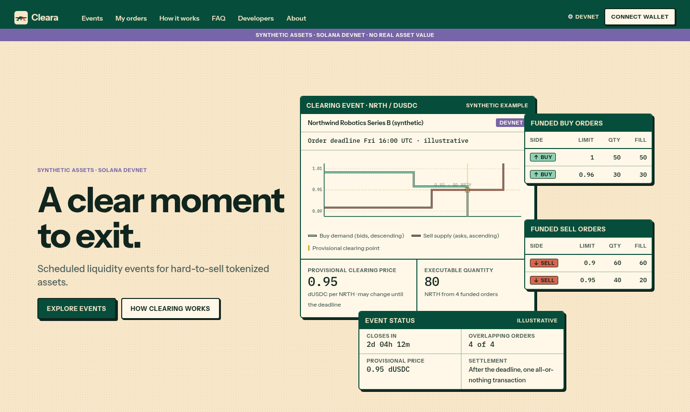
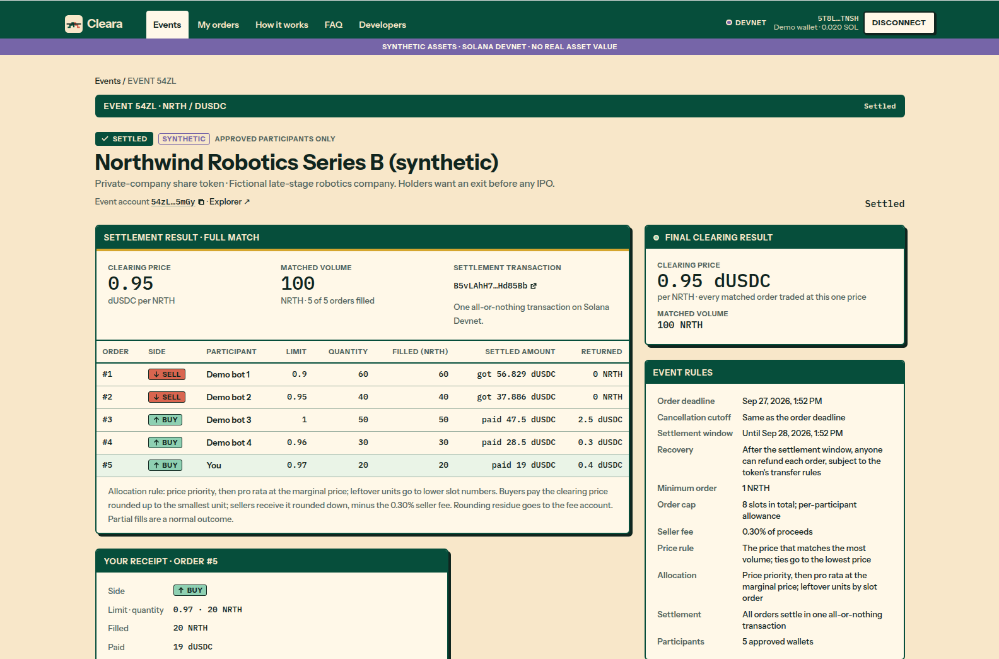
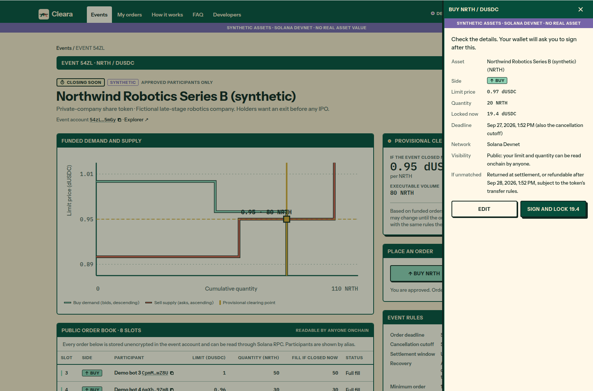
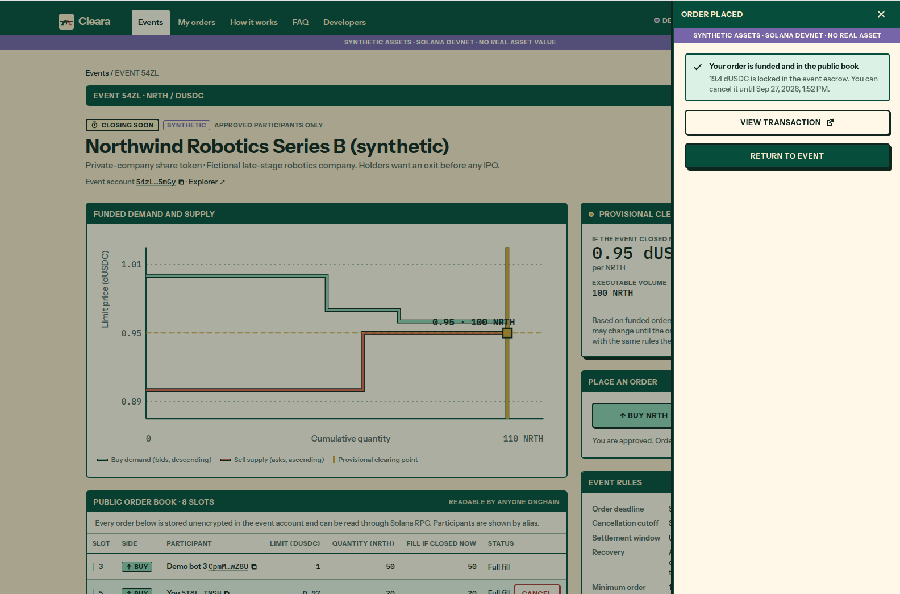
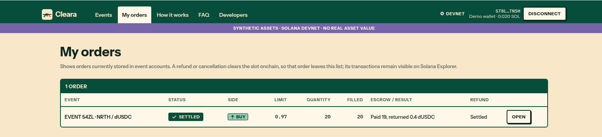
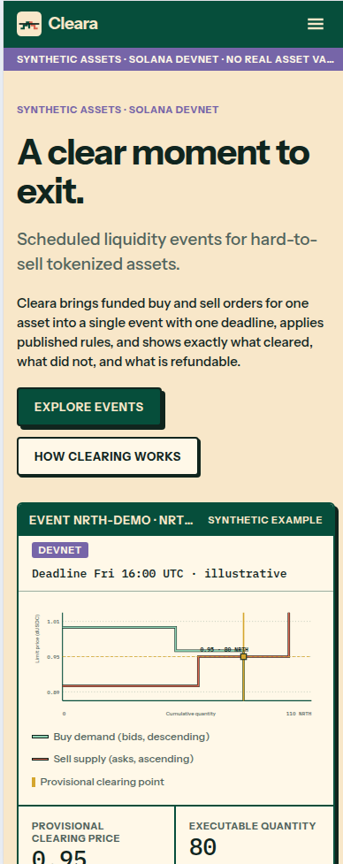
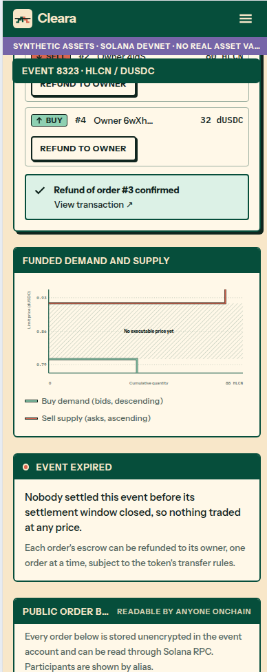

# Cleara

**A clear moment to exit.**

Some tokenized assets, like shares in a private company or a small real-estate token, are hard to sell. There are
few buyers, and the ones who exist rarely show up at the same time as the sellers.

Cleara gives those buyers and sellers a set time to meet. Think of it as a scheduled "selling day" for one asset:
everyone places their order before the deadline, and then everyone who matches trades at the same price, all at once.

Try it: **https://cleara-ten.vercel.app**

> Hackathon prototype for the Colosseum Crypto World's Fair. It runs on Solana's test network (Devnet) with made-up
> assets and test money, so nothing here has real value.



## How it works

1. **An event is scheduled** for one asset, with a deadline and a list of people approved to take part.
2. **Approved buyers and sellers place orders** before the deadline: "I'll buy up to 50 at no more than 1.00 test dollars each" or
   "I'll sell 40 at no less than 0.95". Their money or tokens are held in the event until it ends. Everyone can see the orders.
3. **After the deadline, anyone can press "settle".** Cleara then finds the one price where the most buying and
   selling can happen.
4. **Everyone who matches trades at that price**, all in one step. Anything that didn't match goes back to its owner.

If nobody's prices meet, nothing trades and everyone gets their money or tokens back when the event is settled.
If nobody settles it in time, the event expires and each order can be refunded one by one.



## What Cleara can't promise

- It can't create buyers. If nobody wants the asset, an event won't change that.
- The price is whatever the orders produce. It isn't a "fair value" estimate.
- Orders are public, so people can see the book and wait until the last minute.
- If the asset's issuer freezes or blocks a token, Cleara can't move it.

## Try the demo (about 5 minutes)

1. Open https://cleara-ten.vercel.app and click **Explore events**.
2. Click **Connect wallet** and choose **Cleara demo wallet (Devnet)**. It's a throwaway test wallet in your browser,
   with no extension or sign-up.
3. Under **Try it**, pick an asset and a starting order book, then click **Start demo event**. You get a 4-minute event with a few practice
   orders already in it.
4. Place a buy or sell order. If you need test tokens, click **Get demo funds**. Check the summary, then confirm.
5. Watch the expected price update. You can cancel and place the order again before the deadline.
6. When time runs out, click **Settle event now** and see your receipt.
7. Open **My orders** to see your history, or look at the other example events (finished, partly filled, expired).

| Check before you confirm | Your order in the public book |
| --- | --- |
|  |  |



| Phone: home | Phone: expired event |
| --- | --- |
|  |  |

Each event page also shows what selling right now on Jupiter (a Solana trading app) would give for a similar real
token, so you can compare. That quote comes from the real market and is kept clearly separate from the test event.

---

# For developers

Everything below is the technical detail: addresses, code layout, setup and the program's rules.

## Devnet deployment

| Item | Address |
| --- | --- |
| Program | [`AnVHa4HHZHhUTepWnSGwxDLUEmkKyAuD6sHeKPtTSY6W`](https://explorer.solana.com/address/AnVHa4HHZHhUTepWnSGwxDLUEmkKyAuD6sHeKPtTSY6W?cluster=devnet) |
| Upgrade authority | `6zucjHBkFGvYrMckh3eamw9Bq5KmAWRLVJvqXSYG4nMp` |
| Quote mint (dUSDC, synthetic) | `Fk454Hd66rMQ2kRtNsCRF3m6XKZgGy8d8RWPvvVaDrCX` |
| NRTH, Northwind Robotics (synthetic) | `HFHZDubMuKFJ1Q1WEtF7GoxNjgA2WfsnXErfVdhMmUiC` |
| HLCN, Halcyon Solar Credit Note (synthetic) | `Cp12dQeWgNRuUbDXHnkW1rRx5DeCrN2ykr3epiXtNda7` |
| ORCH, Orchard Lane Residences (synthetic) | `GR9xzAkoqQ9YcAqGbqEBNYwoCkcuQ4F7LyJsKUEvpnBP` |

## Repository layout

```
programs/cleara/        Anchor program (lib.rs: instructions and accounts, clearing.rs: clearing algorithm)
tests/cleara.ts         Integration tests against a local validator
app/                    Web app (Vite, React 19, TypeScript, Tailwind 4, wallet adapter)
  src/                  Pages, components, chain client (lib/chain.ts), demo wallet
  shared/               Bigint clearing mirror of the program, config, demo scenarios
  server/               Demo operator logic and the /api/demo handler (server-side signing)
  api/demo.js           Generated Vercel function (npm run build:api); do not edit
  scripts/              One-time Devnet setup and event seeding
docs/images/            README screenshots
```

## Run the web app locally

Requires Node 22.

```bash
cd app
npm install
npm run dev          # http://localhost:5173, reads Devnet directly
```

`npm run dev` serves the UI only. The demo wallet funding and "start your own event" buttons call `/api/demo`, which
runs as a Vercel function; use `npx vercel dev` to serve it locally.

| Variable | Where | Purpose |
| --- | --- | --- |
| `VITE_RPC_URL` | browser, optional | Solana RPC (default `https://api.devnet.solana.com`) |
| `RPC_URL` | server and scripts, optional | Solana RPC for the operator |
| `CLEARA_OPERATOR_SECRET` | server only | Operator keypair that funds demo wallets and creates demo events. Never expose it to the browser. |

Checks: `npm run typecheck`, `npm run lint`, `npm run build`. After changing `server/`, run `npm run build:api`
and commit the regenerated `api/demo.js`.

The Devnet setup scripts (`scripts/setup-devnet.ts`, `scripts/seed-events.ts`) read keypairs from
`~/.config/solana/cleara-owner.json` and `~/.config/solana/cleara-operator.json`, which are never committed. Run them with `npx tsx`.

### Demo API

`POST /api/demo` with a JSON body:

- `{ "action": "fund", "wallet": "<pubkey>", "asset": "<base mint>", "base": "<atoms>", "quote": "<atoms>" }` tops up
  synthetic tokens and a little SOL, up to fixed caps.
- `{ "action": "event", "wallet": "<pubkey>", "asset": "<base mint>", "scenario": "crossing" | "partial" | "no-overlap" }`
  creates a 4-minute event with bot orders and puts the wallet on the roster.

The operator refuses requests once its balance falls below 0.5 SOL. There's no per-caller rate limit yet.

## What the program guarantees

- Everyone matched trades at the **same price**.
- Settlement is **atomic**: every transfer succeeds or none do.
- Unmatched funds and tokens are returned; after `settle_by`, **anyone** can refund any single order.
- Vault balances are checked against escrowed orders before settlement and must be exactly zero after it.

## What it does not guarantee

- A "fair" price: the price is whatever the participating orders produce.
- Hidden orders: the book is stored in plain account data and readable by anyone over RPC. Late bidding is possible.
- Buyers: an auction cannot create demand.
- Refunds through issuer controls: if the issuer freezes an account or vault, transfers to/from it fail. Refunds are
  per order so one blocked account does not block the others.

## Clearing rules

| Rule | Implementation |
| --- | --- |
| Order book | Fixed array of 8 slots inside the `Auction` account (canonical membership, no external order accounts) |
| Participants | Issuer-supplied roster (max 8) with a per-participant active-order allowance |
| Minimum size | `min_base_qty` per order |
| Self-trade | A participant cannot hold orders on both sides |
| Deadline | One deadline for placing and cancelling; cancelled slots can be reused before it |
| Clearing price | Candidate prices = all limit prices; pick max matched volume, ties go to the lowest price |
| Allocation | Price priority; pro-rata inside the marginal price level; leftover atoms one each to lowest slot index |
| Rounding | Buyers pay `ceil(fill * price)`, sellers receive `floor(fill * price)`; the difference goes to the fee account |
| Fee | `fee_bps` on seller proceeds (max 10%) |
| Settlement | `settle` between `deadline` and `settle_by`; `remaining_accounts` = [base, quote] token account per non-empty slot, in slot order, owner and mint checked |
| Expiry | After `settle_by`, `refund_expired(slot)` is permissionless |
| Tokens | Base and quote can be SPL Token or Token-2022. Token-2022 mints may only use `MetadataPointer` / `TokenMetadata` (no transfer fees, hooks, scaled amounts, etc.) |

Prices are quote atoms per one whole base token.

## Settlement benchmark (localnet, agave 4.2.2)

8-order settlement (4 sellers, 4 buyers, Token-2022 base, SPL quote): **1009 bytes, ~69k CU**, which fits in a legacy
1232-byte transaction. Solana's 4096-byte transactions (v1) leave headroom for a larger book or transfer-hook accounts;
that has not been benchmarked yet.

## Program tests

Rust unit tests (`clearing.rs`): full cross, no overlap, price priority, pro-rata remainder, exhaustive conservation
check over small books.

TypeScript integration tests (`tests/cleara.ts`):

1. Overlapping orders clear at one price (balances, fees, empty vaults, no double settlement)
2. Not enough buyers: partial fill plus refund
3. No overlap: nothing trades, everyone refunded
4. Never settled: settlement rejected after expiry, anyone can refund
5. Guards: roster, allowance, self-trade, minimum size, cancel/reuse, deadlines
6. Settlement rejects missing, reordered or substituted token accounts
7. A frozen account blocks atomic settlement, and other orders can still be refunded
8. Token-2022 mint with a transfer fee is rejected
9. 8-order capacity benchmark

## Build and test the program

Requires Anchor 0.32.1, a Rust 1.89 host toolchain for the IDL build, Agave 4.x (`cargo-build-sbf` with platform-tools v1.54), Node 22, Yarn.

```bash
yarn install
cargo test --manifest-path programs/cleara/Cargo.toml
cargo-build-sbf --manifest-path programs/cleara/Cargo.toml --sbf-out-dir target/deploy
RUSTUP_TOOLCHAIN=1.89.0 anchor idl build -o target/idl/cleara.json -t target/types/cleara.ts
solana-test-validator --reset --bpf-program AnVHa4HHZHhUTepWnSGwxDLUEmkKyAuD6sHeKPtTSY6W target/deploy/cleara.so
ANCHOR_PROVIDER_URL=http://127.0.0.1:8899 ANCHOR_WALLET=~/.config/solana/id.json \
  yarn run ts-mocha -p ./tsconfig.json -t 1000000 tests/**/*.ts
```

## Legal

Checking who may hold a token is not permission to operate a securities market. A production launch requires a
licensed partner and legal review. This repository is a technical prototype only.

## License

[MIT](LICENSE)
